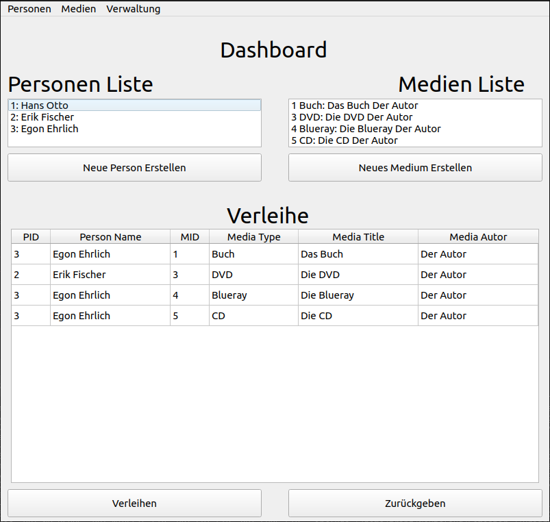
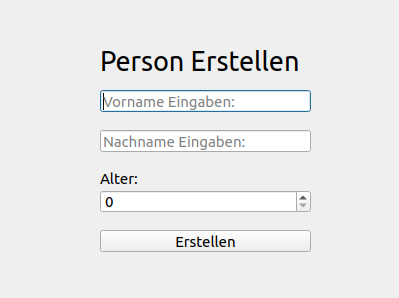
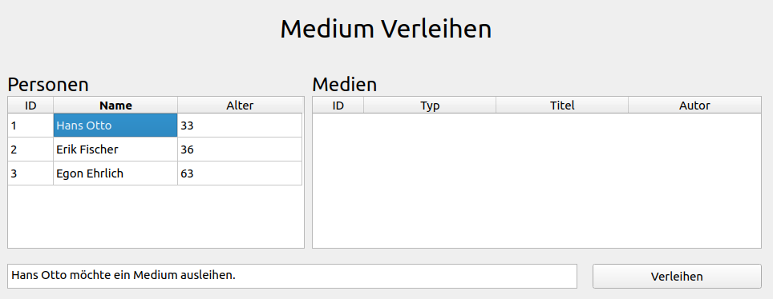

# Medienverwaltung von Franz Starke

## Beschreibung

**Zusammenfassung:**  
Bei diesem Programm handelt es sich um eine Belegarbeit der HTWD von Franz Starke.  
Ziel der Arbeit ist die Implementierung eines Programms zur Medienverwaltung unter Anwendung der objektorientierten Programmierung in C++.

**Implementierung:**  
Das Programm umfasst vier verschiedene Medientypen, die durch Vererbung realisiert wurden, wobei bewusst auf den Einsatz von virtuellen Funktionen verzichtet wurde. Die Steuerung des Programms erfolgt über eine grafische Benutzeroberfläche, welche mit der QT-Bibliothek umgesetzt wurde. Dabei kommen die Module QList und QString zum Einsatz. Alle UI-Elemente wurden mithilfe von Qt Creator erstellt.

**Funktionalität:**  
Beim Start des Programms wird das Dashboard geladen, welches eine Übersicht über alle erstellten Personen, Medien und Verleihvorgänge darstellt.



Über die Schaltflächen „Neue Person Erstellen“ und „Neues Medium Erstellen“ können entsprechende Eingabefenster geöffnet werden, in denen die Daten für neue Objekte eingetragen werden. Nach dem Drücken des "Erstellen" Knopfs wird das Dashboard aktualisiert und das Projekt gespeichert. Diese Funktionen sind auch über das Menü am oberen Fensterrand zugänglich.



Für die Bearbeitung von Personen oder Medien kann im Menü der Punkt „Verwalten“ ausgewählt werden, (im Menü am oberen Fensterrand), wodurch ein neues Fenster geöffnet wird, dass eine Tabelle der Objekte anzeigt. Zur Bearbeitung eines Objekts wird dessen Zeile in der Tabelle ausgewählt, wodurch alle relevanten Felder auf der rechten Seite des Fensters ausgefüllt werden. Nach dem Klicken auf „Speichern“ oder „Löschen“ wird das Projekt gespeichert und das Dashboard aktualisiert, wobei das Unterfenster geöffnet bleibt.

**Verleihvorgang:**  
Um ein Medium zu verleihen, müssen eine Person und ein Medium vorhanden sein. Auf dem Dashboard wird zunächst „Verleihen“ ausgewählt und anschließend die entsprechenden Zeilen der Person und des Mediums in der Tabelle markiert. In einem Ausgabefeld wird die Verleihabsicht angezeigt. Liegt jedoch eine Altersbeschränkung vor, die die Person nicht erfüllt, wird dies ebenfalls ausgegeben. Das Dashboard wird dann aktualisiert und das Projekt gespeichert.



**Rückgabeverfahren:**  
Die Rückgabe eines Mediums wird durch Klicken auf den Button „Zurückgeben“ eingeleitet. Danach kann das gewünschte Medium aus einem Dropdown-Menü ausgewählt werden. Bei Bestätigung wird das Dashboard aktualisiert und das Projekt gespeichert.

Bei dieser Belegarbeit wurden keine KI-Tools für die Code generierung genutzt.

## Abgabeinhalte

- Readme.md
- Bilder 3 zur Dokumentation
- save.txt
- beleg.pro
- 23 .h Dateien
- 14 .cpp Dateien
- 07 .ui Dateien

## Versionen

- QT-Creator: 13.0.2
- QT: 5.15.3
- QMake: 3.1

## Build Anweisung

```bash
sudo qmake
```

Dadurch werden alle QT Relevanten Dateien vorbereitet und erstellt. Das beinhaltet z.B. alle .ui Dateien.

```bash
sudo make
```

Hiermit wird eine ausführbare Datei erstellt.

```bash
./beleg
```

Damit wird das Projekt ausgeführt.
